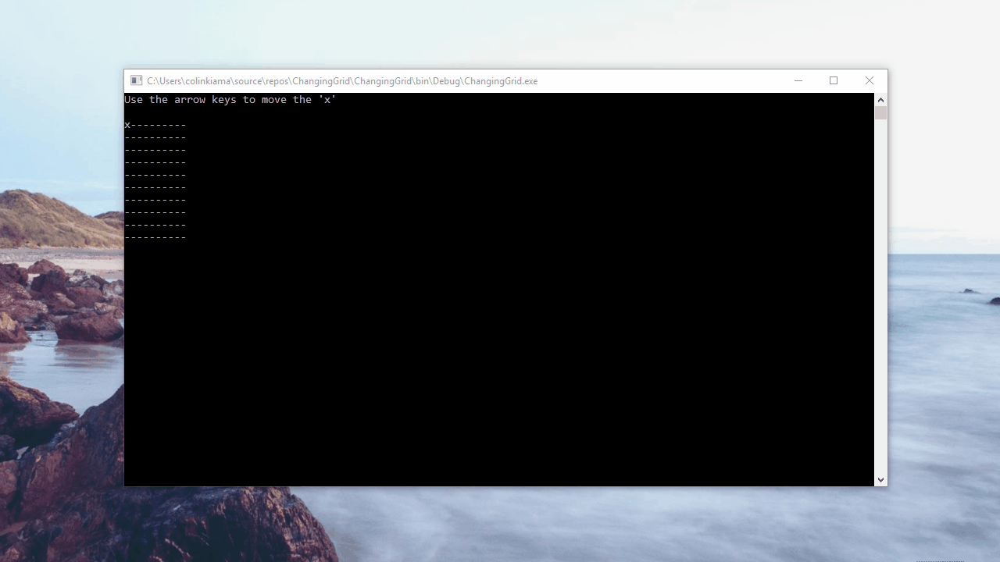

# Changing-Grid-C-Sharp-Console-Program
C# Console Program that has a grid that updates when you press one of the arrow keys.
Each key corresponds the direction a character "x" will move on the grid.

If you try to move the character out of bounds, the character will wrap around the grid, go to the next row etc.

